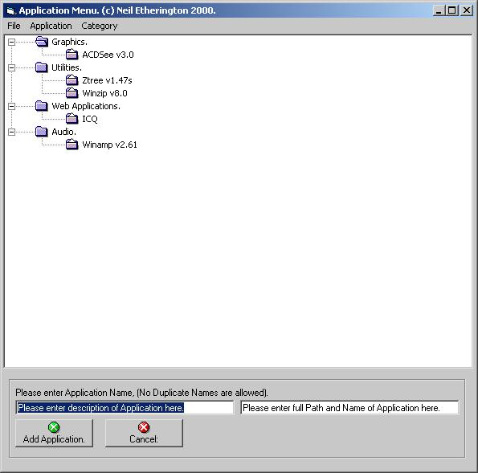



## Application Menu

### Description

SORRY ABOUT MISSING .DLL. Copy Dll to Windows System.

This Application can be used for a Bookmark for a

Web browser or a Shell application for a File manager.

Add the categories eg (Utilities, Graphics etc).

Then add the Applications to the Categories. (Name

and Fullpath of Application). If the File cannot be found

a msgbox will let the User know. Dbl_Click on an

Application and it will be executed. Everything is

saved to a single File and reloaded into the Treeview

when Loaded. This .dll is part of a Advanced File Manager

that i`m writing. thats why it contains quite a few functions.
 
### More Info
 
Categories then sub Applications to Categories.

             |
---                |---
**Submitted On**   |2001-01-06 15:35:26
**By**             |[Nelly](https://github.com/Planet-Source-Code/PSCIndex/blob/master/ByAuthor/nelly.md)
**Level**          |Beginner
**User Rating**    |4.7 (14 globes from 3 users)
**Compatibility**  |VB 6\.0
**Category**       |[Complete Applications](https://github.com/Planet-Source-Code/PSCIndex/blob/master/ByCategory/complete-applications__1-27.md)
**World**          |[Visual Basic](https://github.com/Planet-Source-Code/PSCIndex/blob/master/ByWorld/visual-basic.md)
**Archive File**   |[CODE\_UPLOAD13450162001\.zip](https://github.com/Planet-Source-Code/nelly-application-menu__1-14187/archive/master.zip)

### API Declarations

Shellexecute.

